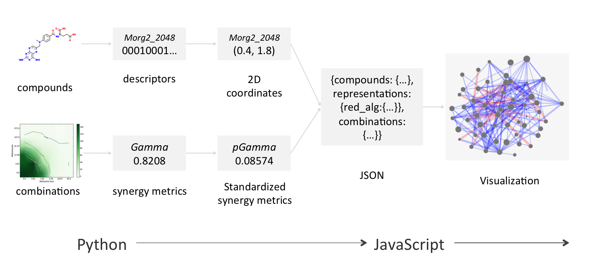

Introduction
============

Synergy maps are a novel visualization technique for exploring pairwise
combination datasets, developed in the `Centre for Molecular Informatics`_
of the `Chemistry Department`_ of the `University of Cambridge`_.  This is the
documentation for an interactive implementation, written by `Richard Lewis`_,
whilst a PhD student under the supervision of `Andreas Bender`_.

Software
--------

Briefly, the data processing is done on the :doc:`Python backend <backend>`,
and the visualization is produced by the :doc:`JavaScript frontend <frontend>`:

There is a `demo`_ of the interactive frontend for some example datasets hosted on GitHub.

Paper
-----

The accompanying paper has been preliminarily been accepted into the
`Journal of Chemininformatics`_ as part of the `Mixtures and Combination Modelling thematic issue <mixtures thematic issue>`_.

.. _Centre for Molecular Informatics: http://www-ucc.ch.cam.ac.uk
.. _Chemistry Department: http://www.ch.cam.ac.uk
.. _University of Cambridge: http://www.cam.ac.uk
.. _demo: http://richlewis42.github.io/synergy-maps
.. _Journal of Chemininformatics: http://www.jcheminf.com
.. _Richard Lewis: http://www.ch.cam.ac.uk/group/bender/person/rl403
.. _Andreas Bender: http://www.ch.cam.ac.uk/person/ab454
.. _Mixtures thematic issue: http://www.jcheminf.com/about/update/Mixtures_combination_modeling
